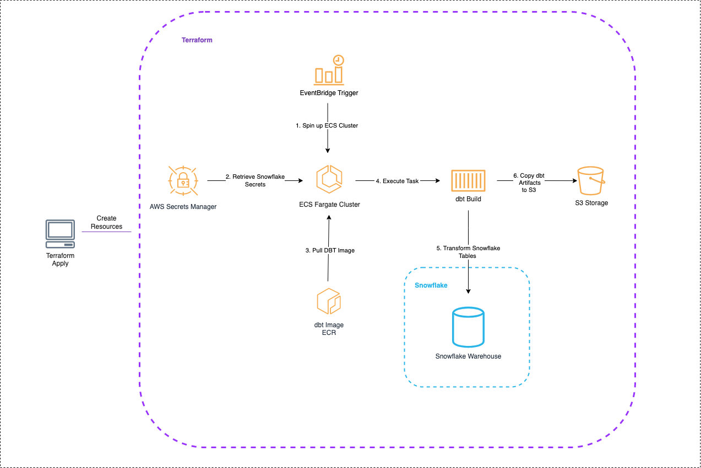

# nhl-analytics-dbt

# General Overview

1. Running terraform apply will create all of the necessary resources to run DBT
2. A cloudwatch event rule will trigger on a cron schedule
3. An ECS task is instantiated on trigger
4. The task fetches secrets from AWS secrets manager and sets as ENV variables in container 
5. The models  are transformed in the ECS task
6. The artifacts are copied to an S3 bucket for documentation site hosting

## Architecture
Below is a diagram showing the high-level architecture for this project:

